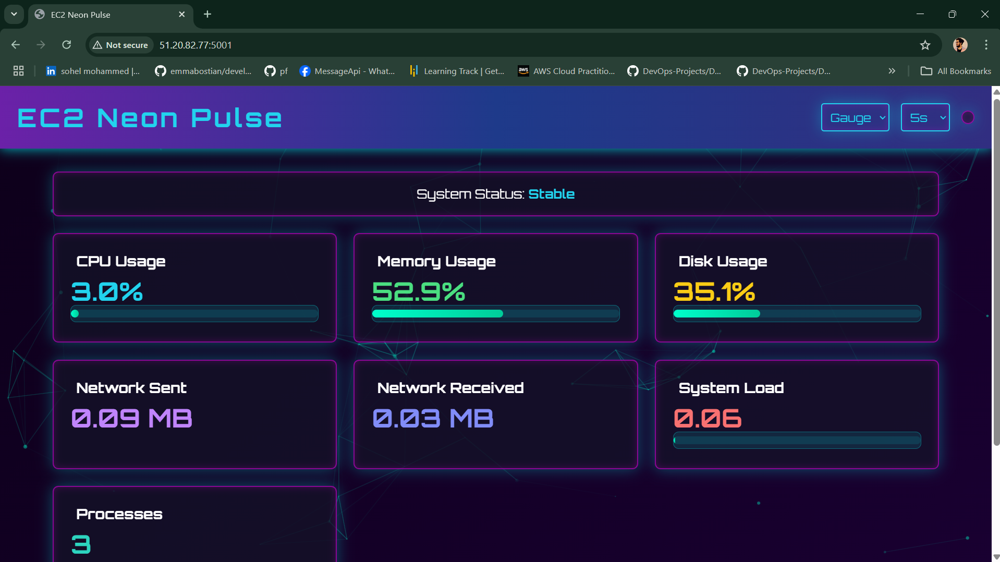

# EC2 Neon Pulse - A Cyberpunk-Style EC2 Monitoring Dashboard

EC2 Neon Pulse is a lightweight, visually stunning monitoring dashboard for your EC2 instance, providing real-time insights into system performance. With a cyberpunk aesthetic, this dashboard offers CPU, memory, disk usage, network activity, and process count in a sleek, easy-to-use interface.



## Features
- **Real-time monitoring**: Track CPU, memory, disk, network usage, and running processes.
- **Redis-backed data storage**: Stores recent metrics for fast retrieval.
- **Cyberpunk UI**: A visually engaging dashboard experience.
- **Containerized deployment**: Run as a Docker container with minimal setup.
- **Health check support**: Ensures the application is running smoothly.

## Prerequisites
Before you start, ensure you have the following installed on your system:
- **Docker** (Installation guide: https://docs.docker.com/get-docker/)
- **Redis** (For persistent metric storage; optional but recommended)

## Installation & Usage
### 1. Pull the Docker Image
```sh
docker pull sohelqt8797/ec2-neon-pulse:latest
```

### 2. Run the Container
#### Without Redis (Basic Mode):
```sh
docker run -d -p 5001:5001 --name neon-pulse sohelqt8797/ec2-neon-pulse:latest
```

#### With Redis (Recommended for better performance tracking):
```sh
docker network create neon-net

docker run -d --name redis-server --network=neon-net redis:alpine

docker run -d -p 5001:5001 --name neon-pulse --network=neon-net \
  -e REDIS_HOST=redis-server sohelqt8797/ec2-neon-pulse:latest
```

### 3. Access the Dashboard
Open your browser and navigate to:
```
http://localhost:5001/
```

## API Endpoints
The following endpoints are available:
- **Dashboard UI**: `GET /` - Displays real-time system metrics in a visually stunning interface.
- **Metrics API**: `GET /metrics` - Returns system metrics in JSON format.

## Environment Variables
| Variable    | Default  | Description |
|------------|----------|-------------|
| `REDIS_HOST` | `localhost` | Redis server hostname or IP |
| `REDIS_PORT` | `6379` | Redis server port |
| `FLASK_ENV` | `production` | Flask environment mode |

## Health Check
The container includes a health check that runs every 30 seconds.
```sh
curl -f http://localhost:5001/ || exit 1
```

## Stopping & Removing the Container
To stop the container:
```sh
docker stop neon-pulse
```

To remove the container:
```sh
docker rm neon-pulse
```

To remove the network (if used):
```sh
docker network rm neon-net
```

## Contributing
Feel free to fork this repository and improve the project. Contributions are welcome!

## License
This project is licensed under the MIT License.

## Boom! 🚀 Stunning Cyberpunk Monitoring Dashboard Ready!
Enjoy real-time insights into your EC2 instance with Neon Pulse! 🎉

